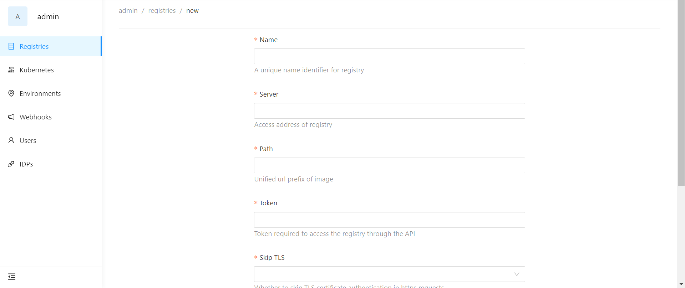

This section describes how to deploy your first workload step by step.

## 1. Login Horizon CD
The initial password for the admin account is auto-generated when you perform the installation. Using the email `admin@cloudnative.com` and the password, login to Horizon CD.
1. Open Horizon CD's home page in your browser and click on **Login**.

2. Enter the email and password to log in.

> Now, you need create some **required system resources** to set up your devops platform. 

## 2. Create a registry
1. Click on the **More** option in the top of the home page and select **Admin**.
2. Click on the **Registries** option in the left-side menu.
3. Click **Add registry** to enter the page below.

4. Fill in your registry information and click **Submit** to add it.
> Note that **harbor** is only supported now as a registry.

## 3. Create a kubernetes cluster
1. Click on the **More** option in the top of the home page and select **Admin**.
2. Click on the **Kubernetes** option in the left-side menu.
3. Click **Add kubernetes** to enter the page below.

4. Fill in your kubernetes information and click **Submit** to add it.
5. Then, enter your kubernetes page, click **Add tags** to add a specific tag which is used to link your group and kubernetes. For example:

6. Click **Submit** to add the tag.

## 4. Create an environment
1. Click on the **More** option in the top of the home page and select **Admin**.
2. Click on the **Environments** option in the left-side menu.
3. Click **New environment** to enter the creation page.

4. Fill in your kubernetes information and click **Submit** to create the environment.
5. Finally, enter your environment page, click **Link kubernetes** to link the kubernetes you just added.

## 5. Create a template
A template is required to hold build and deploy configurations of your applications. Now, let's create a public template: 
1. Click on the **Templates** tab in the top of the home page.
2. Select **Public templates** and click on **New template** in the top right corner of the page.

3. Enter the relevant information for the template.
> Note that **Git repo** is the clone link of the template, through which Horizon pulls it. A sample template of deployment workload (https://github.com/horizoncd/deployment.git) is provided to you to deploy your first workload. You can use it as shown below:

4. Click on **Submit**.

## 6. Create a group
Now create and administer a new group:
1. Click on the **Groups** tab in the top of the home page.
2. Click **New group** to create you own group.
3. Groups need bound kubernetes which is used to deploy your applications by tags. Now, link kubernetes resources to your new group: 
   1. Enter your group page, click on **Settings** in the left sidebar and select **Advance**.
   2. click on **Add tags** and fill in the tag your kubernetes holds.

## 7. Create an application
1. From the group page, click **New application** button to start to create a new application.
2. Fill some basic information of your application and click **Next**.
> A sample application git repository (https://github.com/horizoncd/springboot-source-demo.git) is provided. You can use it as shown below:

3. Select **dockerfile** build type and fill `Dockerfile` in dockerfile path. Then click **Next**.

4. Select your template and fill your deploy configurations.

5. Click **Next** and audit your configurations.
6. Click **Submit** to create it.

## 8. Create a cluster
1. From the application page, click **New cluster** button to start to create a new cluster.
2. Select environment and region where you want to deploy the cluster.
3. Click **Next** and **Submit** to create it.

## 9. Deploy your cluster
Now, it is the last step to deploy your first workload!
1. From the cluster page, click **Build and deploy** button
2. Select your git reference and check the differences from the last revision.
3. Click **Submit** button to confirm the build and deploy.
4. Check the pipeline's log and cluster status.
5. When the cluster status is **healthy**, your first `deployment` workload is successfully deployed on kubernetes!
