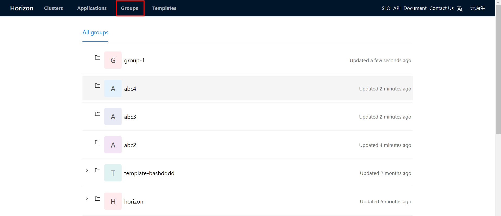
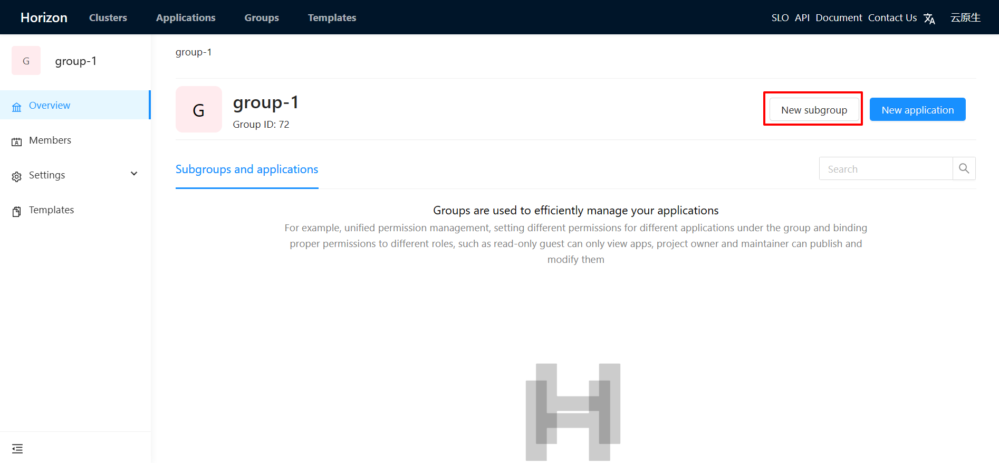
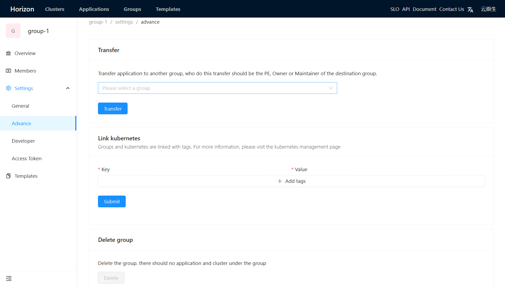

# Groups

## Groups
Groups provide a logical grouping of applications from multiple teams, which provide the following features: 
* defining templates in group to deploy custom applications
* defining member roles to provide application and cluster RBAC
* managing access tokens for the resources that need access to the Horizon CD API
* managing Oauth apps that can use Horizon as an OAuth provider
* providing other advanced features (e.g. migration, linking to kubernetes etc...)

## Permissions
Group features are provided for different roles to manage groups. The following table lists the permissions available for each role: 
 
|      Action     |      Guest      |   Maintainer    |       PE        |      Owner      |
|:---------------:|:---------------:|:---------------:|:---------------:|:---------------:|
|      Create     |                 |        √        |        √        |        √        |
|       Edit      |                 |        √        |        √        |        √        |
|     Transfer    |                 |        √        |        √        |        √        |
| Link kubernetes |                 |                 |        √        |        √        |
|      Delete     |                 |                 |                 |        √        |

## Creating groups
> **Note that** Only administrators can create root groups.

1. Click **Groups** tab at the top navigation, and select and click to the parent group where you want to create a group. 

1. Click **New subgroup** to create you own group. 

<!--  -->
Now, you can manage your group!

## Editing groups

Click on **Settings** in the left sidebar and select **General** to edit your groups. 
<!--  -->

## Advance
Click on **Settings** in the left sidebar and select **Advance** to use advanced features. 

### Transferring groups
You can transfer the group to another group, where your role should be no less than Maintainer. 

### Linking kubernetes
Groups can bound kubernetes which is used to deploy your applications by tags. See [kubernetes](../administrator/kubernetes.md) for More information.  

### Deleting groups
When there is no application or cluster under the group, you can delete it. 